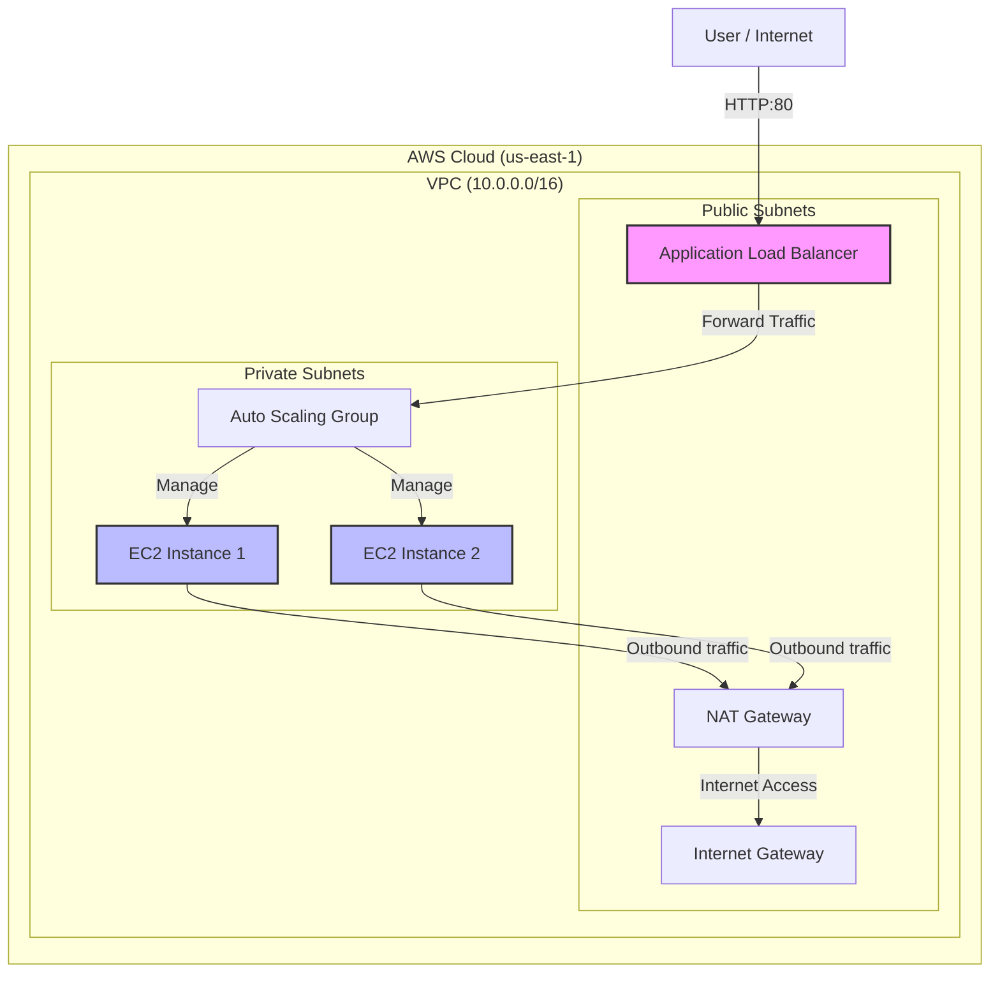

# Architecture Diagram

Here is the visual representation of the infrastructure we deployed. You can copy this code and paste it into Mermaid Live Editor or use it in your presentation.

```mermaid
graph TB
    subgraph "AWS Cloud (us-east-1)"
        subgraph "VPC (10.0.0.0/16)"
            
            subgraph "Public Subnets"
                ALB[Application Load Balancer]
                NAT[NAT Gateway]
                IGW[Internet Gateway]
            end

            subgraph "Private Subnets"
                ASG[Auto Scaling Group]
                EC2_1[EC2 Instance 1]
                EC2_2[EC2 Instance 2]
            end

        end
    end

    User[User / Internet] -->|HTTP:80| ALB
    ALB -->|Forward Traffic| ASG
    ASG -->|Manage| EC2_1
    ASG -->|Manage| EC2_2
    
    EC2_1 -->|Outbound traffic| NAT
    EC2_2 -->|Outbound traffic| NAT
    NAT -->|Internet Access| IGW

    style ALB fill:#f9f,stroke:#333,stroke-width:2px
    style EC2_1 fill:#bbf,stroke:#333,stroke-width:2px
    style EC2_2 fill:#bbf,stroke:#333,stroke-width:2px
```
